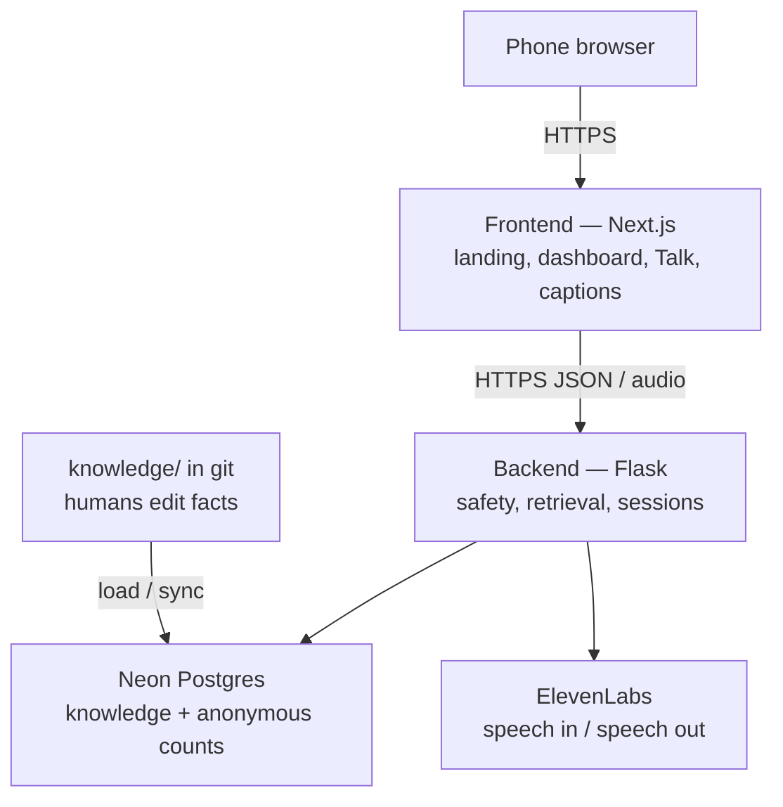
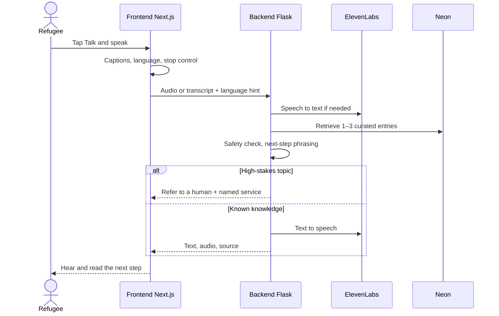

# Maktab AI

> *Maktab* (مكتب) — a place of learning, and of getting things done.

Maktab AI is built for **refugees**: people rebuilding a life in a new place, often with a phone, a first language that is not English, and no patience left for portals. It is a voice conversation in Somali or English — say what you need, hear one next step — so finding school, work, or local help does not require becoming a clerk first.

---

## Problem

Refugees are asked to navigate the same needs as everyone else — school for a child, a job, a scholarship, food, housing, a legal clinic — through English websites, forms, and hold music. The programs are often there; the path is the barrier. Maktab will not pretend to be a government, a clinic, or a visa decision. It exists so a refugee can speak, stay in their language, and leave with a next step: who to ask, what to bring, where to go.

---

## User story

Amina is a refugee. She arrived six months ago with a phone, a little English, and a lot of Somali. Tonight she opens Maktab, taps **Talk**, and says:

> “Waxaan rabaa inaan helo shaqo nadiifin ah magaaladan.”  
> *I want to find cleaning work in this city.*

The screen shows her words as captions. Maktab answers in Somali: two or three realistic next steps, what employers often ask, what to bring, and who locally to ask — with a source, not a guess. It offers to draft a short CV by voice. It never says “you are hired” or “you qualify.” If she asks about asylum or a diagnosis, it stops improvising and points her to a human.

She can switch to English mid-way. She can type if the room is loud. She can do the whole session with speech only. When she closes the tab, her story is not sitting in a database.

That is a good night for Maktab: not a perfect answer to every life, just a clear next step for a refugee who needed one before sleep.

---

## What it helps with

Built around what refugees actually ask for:

| Area | What a refugee can ask |
| --- | --- |
| Education | How to enroll, find classes, study help, language learning |
| Services | What help exists nearby, who to contact, what to bring |
| Jobs | How to look, what a role often requires — not a fake “this job is open” unless verified |
| Scholarships | What exists, who the org *says* it is for, deadlines — never “you qualify” |
| CV / applications | Draft a simple CV by conversation; explain a form field in plain language |
| Community | Groups, places of worship, legal clinics, food and housing leads |

v1 languages: **Somali** and **English**, because those are the first languages we can serve well on a refugee’s phone. Typing is optional.

**Not in v1:** legal or immigration decisions, medical diagnosis, storing identity documents, offline on-device models, every language at once.

---

## Architecture

Two processes, one conversation for the refugee on the other end of the phone. The browser is the mouth and ears. The API is the memory and the voice vendor. Secrets never live in the frontend.



A spoken turn looks like this:



### Frontend (Next.js)

Lives at the **repository root** (`app/`, `components/`, `lib/`). This is everything they see and touch on the phone.

It:

- Renders the landing page, onboarding, dashboard, listings, and the assistant
- Owns the microphone, playback, captions, language toggle, and Talk / Stop
- Talks to Flask only through `NEXT_PUBLIC_API_URL`
- Keeps a light profile on **this device** (name, city, interests) — not a user account
- Works on a small screen, noisy rooms, and slow data

It does **not** hold `DATABASE_URL` or ElevenLabs keys, query Postgres, or invent program facts.

| Path | Screen |
| --- | --- |
| `/` | Landing |
| `/onboarding` | Language, goal, location |
| `/dashboard` | Overview and sample listings |
| `/assistant` | Talk or type |
| `/opportunities`, `/scholarships`, `/education`, `/jobs` | Sample catalogues |
| `/opportunities/[id]` | Listing detail |
| `/profile` | Device-only profile |

Run: `npm install && npm run dev` → [http://localhost:3000](http://localhost:3000). Deploy: [`render.yaml`](./render.yaml) on [Render](https://render.com).

### Backend (Flask)

Lives under `services/`. This is the only process that may call Neon or ElevenLabs.

It:

- Exposes health, CORS, retrieval, and the voice loop (`services/api`)
- Turns speech to text and text to speech through `services/voice` (ElevenLabs)
- Reads **curated** knowledge from Neon — if a fact is not in git or the database, it must not invent it
- Keeps answers short: next step first, source attached, “I don’t know” when the shelf is empty
- Refers high-stakes questions (asylum outcomes, diagnosis, child danger) to a human
- May store anonymous session counts (language, domain, turn count) — not recordings, transcripts, passports, or CVs

Env on Flask only: `DATABASE_URL`, `ELEVENLABS_API_KEY`, voice IDs, `ALLOWED_ORIGINS`.

---

## Repository structure

```
.
├── README.md                 ← this file (the only README)
├── render.yaml               Render Blueprint
├── app/                      routes and layout
├── components/               landing, dashboard, assistant UI
├── lib/                      listings, i18n, device store
├── services/api              Flask
├── services/voice            ElevenLabs helpers used by Flask
├── knowledge/                facts humans edit, then load into Neon
├── docs/                     longer product and privacy notes
├── apps/                     reserved if another client appears later
└── ops/                      env names and runbooks — never secret values
```

Folder notes (not READMEs): `apps/NOTES.md`, `services/NOTES.md`, `knowledge/NOTES.md`, `ops/NOTES.md`, `docs/INDEX.md`.

---

## Run and deploy

```bash
npm install
npm run dev
```

Production: Render **static site** from `render.yaml` (`npm ci && npm run build` → publish `out/`). Microphone needs **HTTPS**.

---

## How we judge a good session

- A refugee who speaks Somali can finish a few minutes **without typing**.
- The assistant stays in their language unless they switch.
- Services, jobs, and scholarships name a **source or organisation**, not only a summary.
- High-stakes questions go to a human with a clear contact path.
- When the knowledge is missing, Maktab says so. A wrong deadline is a product bug.

Never commit API keys. Do not scrape or republish personal stories from refugees who use this.
